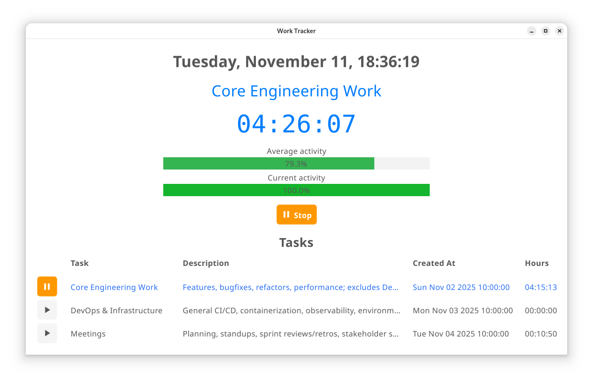
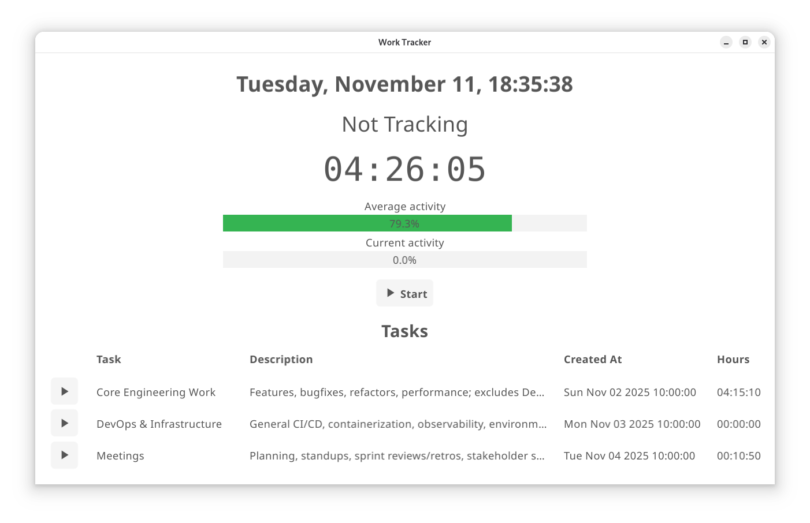
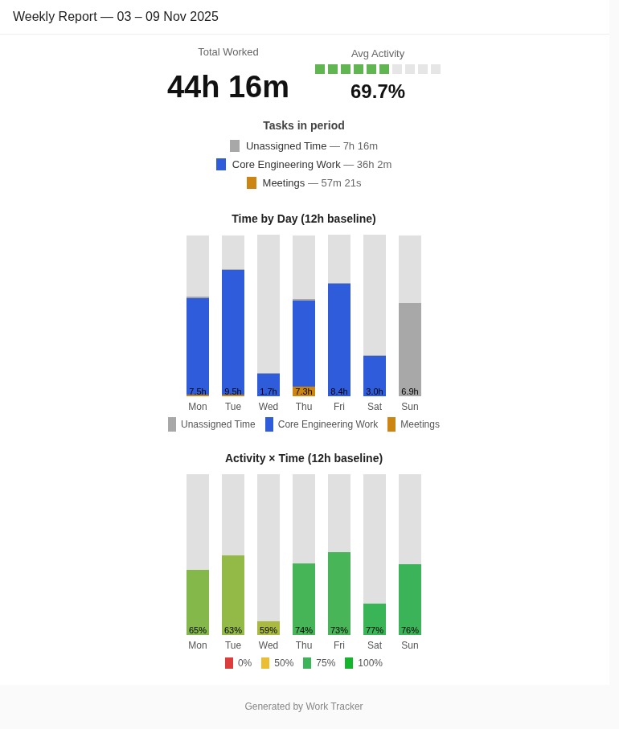
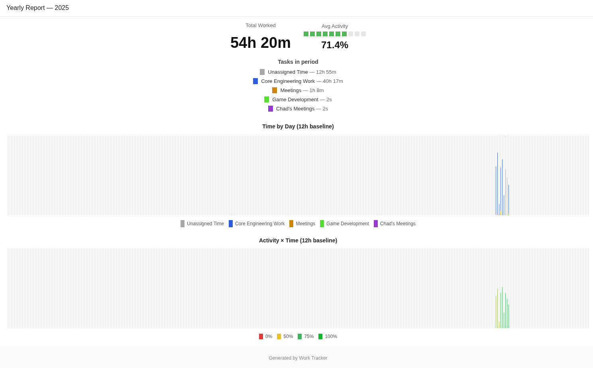

# Work Tracker

A minimal desktop + CLI tool to track focused work time and generate clean HTML reports.
Local-first by default; optionally email reports via Mailgun, SendGrid, or Amazon SES.

> Installation & setup: see **[INSTALL.md](./INSTALL.md)**

  

## Features

- **One-click tracking** per task (start/pause/stop)
- **Activity meter** (current + average)
- **HTML reports** (daily/weekly/monthly/yearly) with time & activity charts
- **Email delivery** via common providers (optional)
- **Local-first** data — nothing leaves your machine unless you send a report

## Screenshots

### Desktop App

   
  

### Weekly Report

  

### Yearly Report

  

## License
MIT — see [LICENSE](./LICENSE).
