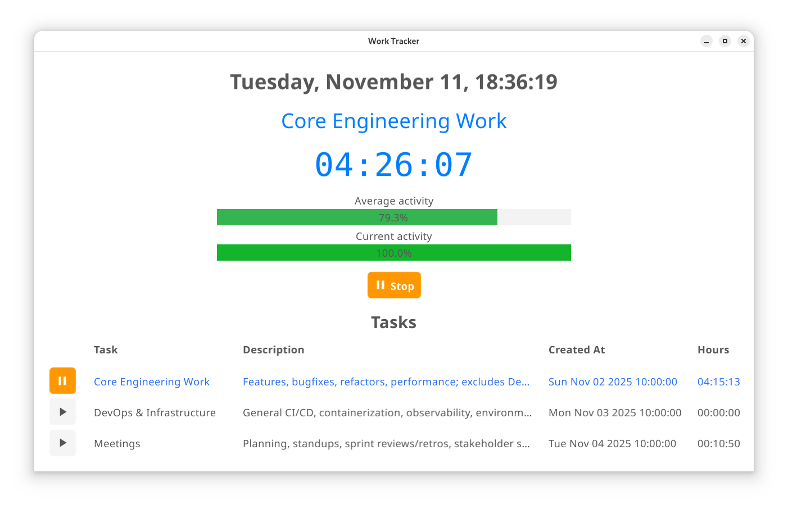
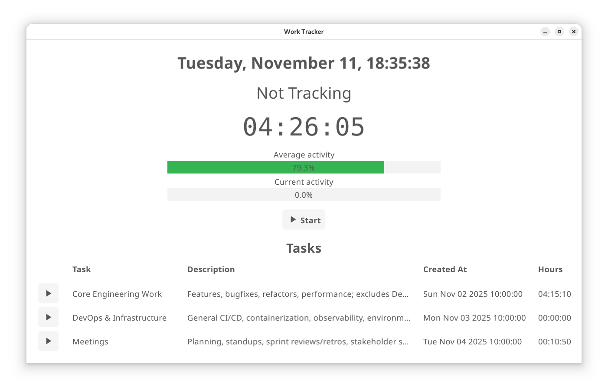
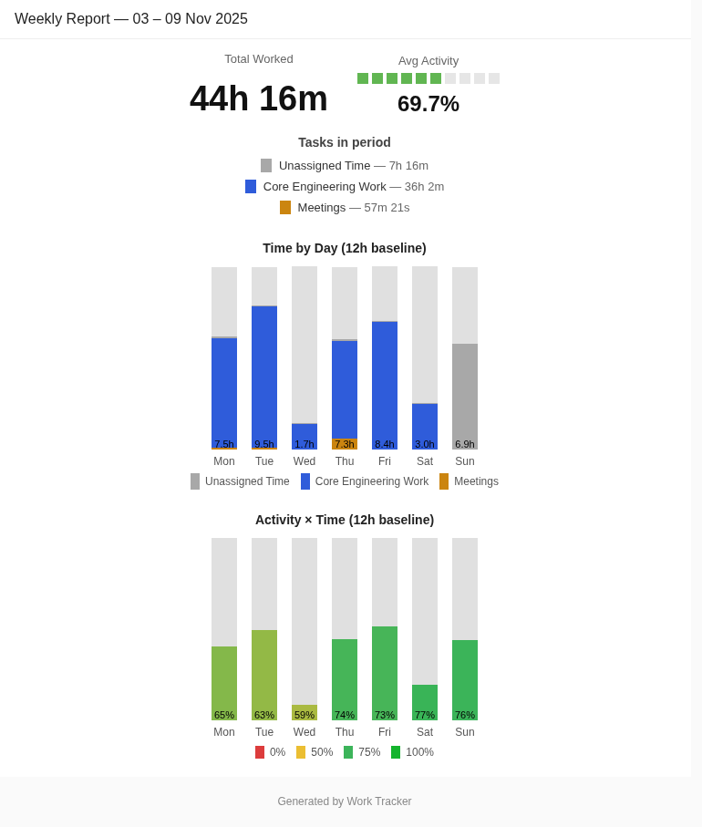
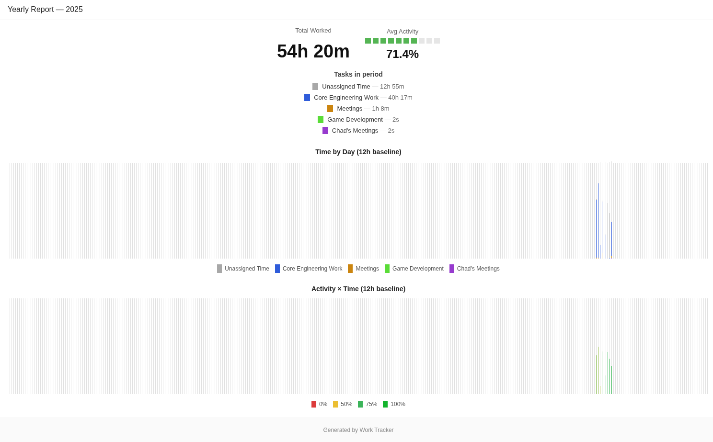

# Work Tracker

A minimal desktop + CLI tool to track focused work time and generate clean HTML reports.
Local-first by default; optionally email reports via Mailgun, SendGrid, or Amazon SES.

> Installation & setup: see **[INSTALL.md](./INSTALL.md)**

<p align="center">
  
</p>

## Features

- **One-click tracking** per task (start/pause/stop)
- **Activity meter** (current + average)
- **HTML reports** (daily/weekly/monthly/yearly) with time & activity charts
- **Email delivery** via common providers (optional)
- **Local-first** data — nothing leaves your machine unless you send a report

## Screenshots

### Desktop App
<p align="center">
  <br>
  
</p>

### Weekly Report
<p align="center">
  
</p>

### Yearly Report
<p align="center">
  
</p>

## License
MIT — see [LICENSE](./LICENSE).

## Add missed time

From the project root, append an entry to today's file:

```sh
go run ./src/cmd/cheat --after 15 --minutes 60 --activity 75
```

This starts 15 minutes after the last entry finishes, logs 60 minutes with
45 active minutes, and inherits the last entry's task. To select another day
or task:

```sh
go run ./src/cmd/cheat --date 2026-09-28 --after 0 --minutes 30 --activity 80 --task "Game Development"
```

`--date` defaults to today in local time, `--after` to 0, and `--activity` to
100. `--minutes` is required and must be positive. `--work-dir` defaults to
`./out`, and `--config` uses the same logger configuration as the other commands.
The entry retains the previous entry's timezone offset. Missing or empty files,
malformed records, and entries extending outside the selected day are rejected.
Pause the tracker before adding time so it does not append an overlapping chunk.

The install script also builds `./build/cheat`. To build just this command:

```sh
go build -o ./build/cheat ./src/cmd/cheat
```
